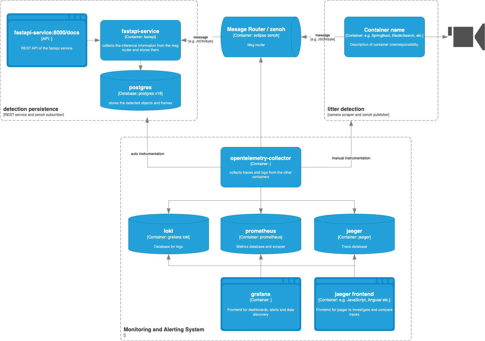

# Litter Detection Demo — System Monitoring with OpenTelemetry & Grafana

A fully observable litter detection pipeline used as the running example in the
**Monitoring and Observability** lecture.

## Architecture



## Quick Start

```bash
# 1 — copy the environment file
cp .env.example .env

# 2 — start everything (synthetic camera mode by default)
docker compose up -d

# 3 — wait ~30s for images to pull and services to start
docker compose ps

# 4 — open Grafana
open http://localhost:3000
```

Start the detector service outside of docker, due to connection with a camera:

```bash
cd detector 

# build the virtual environment
uv sync 

# run the detector service the instrumentation is done in the service via SDK
uv run detector.py

```


> If you want to enable instrumentation on a new service using uv do:
> `uv run opentelemetry-bootstrap -a requirements | uv add --requirement` followd by uv run opentelemetry-instrument python <your_script>.py`


## Service URLs

| Service | URL |
|---|---|
| Grafana (Dashboards) | http://localhost:3000 |
| FastAPI (API docs) | http://localhost:8000/docs |
| Prometheus | http://localhost:9090 |

## Changing models

Set the environment variable `MODEL_NAME` to a different model name.

## Using a Real Webcam


- Then set `CAMERA_MODE=webcam` in your `.env`.
- Use `CAMERA_MODE=synthetic`(the default) for fake data. The synthetic detector produces realistic telemetry data.

## Simulating Slow Preprocessing (for the tracing demo)

In `detector/detector.py`, uncomment the `SLOW_MODE` block inside `preprocess_frame`,
then rebuild:

```bash
docker compose build detector
docker compose up -d detector
```

Open Grafana → Explore → Tempo, filter `duration > 400ms`, and watch the
`preprocess-frame` spans turn red.

## Stopping

```bash
docker compose down -v   # -v also removes named volumes (postgres data, tempo data)
```
